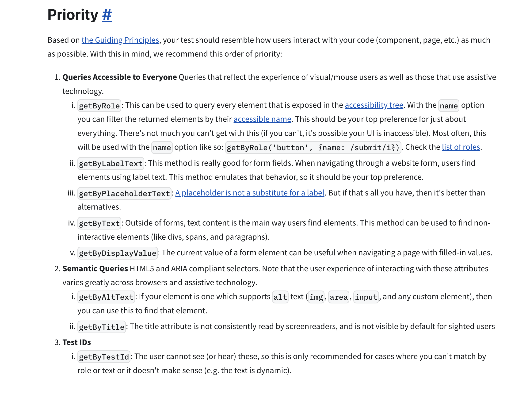

## RTL Tutorial

Alright, now that we have discussed the main concepts and libraries we are going to use in this course, let's start our testing journey with the React Testing Library tutorial, where we will learn the core concepts of React Testing Library as well as testing in general.

Since adding React Testing Library to an existing Vite project requires quite a few steps, and based on my experience, students get bored with such setup at the beginning of the course, I have prepared a project with pre-configured Vite, Vitest, and React Testing Library. This way, we don't need to waste any time and can dive right into the fun part - writing our first tests. With that said, to all the setup junkies - don't worry, we will cover the entire setup process in the next course section.

## Setup

In order to follow along with the course content, you will need to get a hold of the course repository located at this [URL](https://github.com/john-smilga/react-testing-course).I also shared the link in the previous lecture, so
Once you have cloned the repository, open the 01-rtl-tutorial folder in your favorite IDE (in my case VSCode), install the dependencies by running `npm install`, run `npm run dev` to start the project in development mode, and also open another terminal instance and run `npm run test` to start the tests.If everything is set up correctly, you should see the following output in the terminal:

## Files and Folders

This is a boilerplate Vite project, with Typescript, TailwindCSS, and all of the testing libraries already set up for you.

- node_modules - folder containing all the dependencies for the project
- public - folder containing all the static assets for the project
- src - folder containing all the source code for the project
- `src/__tests__` - folder containing test file for App component
- `src/final` - folder containing the entire source code of the project
- `src/tutorial` - where we will be writing our tests and setting up our components
- `src/vitest.setup.ts` - file containing the setup for Vitest
- package.json - file containing all the project dependencies and scripts
  `npm run dev` - script to start the development server
  `npm run test` - script to start the test runner

For the most part we will focus on tests and only navigate to the actual browser from time to time, so dev server can be stopped at any time unlike the test runner which will constantly run in the background to watch for changes and re-run the tests.

Also in the root you will find README.md file with the course outline, more detailed explanations of the course content,links to additional resources, code examples which you can use as a reference, and other helpful information. So make sure to check it out.

## Explore our First Test

First take a look at the `src/App.tsx` file and notice the heading with the text "React Testing Library". This is the component we will be testing.

src/App.tsx

```tsx
function App() {
  return (
    <div className='p-8'>
      <h1 className='font-bold text-2xl'>React Testing Library</h1>
      <p className='mt-4 text-gray-700'>
        React Testing Library and Vitest work together to provide a robust
        testing environment.
      </p>
    </div>
  );
}
export default App;
```

Open the `App.test.tsx` file in the `src/__tests__` folder and take a look at the first test.

```tsx
import { render, screen } from '@testing-library/react';
// Note: technically already available globally
import { test, expect } from 'vitest';
import App from '../App';

// test is a function provided by Vitest that defines a single test case.
// it takes two arguments: a string description of what the test should do, and a callback function containing the actual test code.
// When you run your tests, each test block runs as a separate test, and the description helps identify which test passed or failed.
// Note that `test` and `it` are aliases - they do exactly the same thing and can be used interchangeably.

test('should render heading with correct text', () => {
  // Render the App component
  //mounts your React component into a simulated browser environment.
  render(<App />);

  // `screen.debug()` is a function that logs the current state of the virtual DOM to the console. It helps you visualize the component's structure and see what's being rendered.

  screen.debug();

  // `screen` is an object provided by `@testing-library/react` that contains methods for querying and interacting with the virtual DOM.

  //`screen.getByText('Random Component')` is a function that searches for an element with the text "Random Component" in the virtual DOM.

  const heading = screen.getByText('React Testing Library');

  // Verify that the heading is present in the document
  // `expect` is an assertion function.is used to create assertions.
  // `toBeInTheDocument()` is a matcher that checks if the element is present in the virtual DOM.
  expect(heading).toBeInTheDocument();
  expect(2 + 2).toBe(4);
});
```

## Explanation

The `test` function is a fundamental testing function that defines a single test case. It takes two arguments: a string description of what the test should do, and a callback function containing the actual test code. When you run your tests, each `test` block runs as a separate test, and the description helps identify which test passed or failed. For example, `test('should render heading', () => { ... })` creates a test that verifies if a heading renders correctly. Note that `test` and `it` are aliases - they do exactly the same thing and can be used interchangeably.

`render()` is a function provided by `@testing-library/react` that mounts your React component into a JSDOM environment (a simulated browser environment). JSDOM creates the virtual DOM, and the render function sets up the component within this environment so you can test it. Think of it as "painting" your component onto a simulated webpage for testing purposes.

`screen.debug()` is a function that logs the current state of the virtual DOM to the console. It helps you visualize the component's structure and see what's being rendered.

`screen` is an object provided by `@testing-library/react` that contains methods for querying and interacting with the virtual DOM.

`screen.getByText('Random Component')` is a function that searches for an element with the text "Random Component" in the virtual DOM. It returns the first element that matches the text.

`expect()` is a function that wraps an actual value you want to test. It creates an "expectation" object that lets you check different things about that value using matchers. Think of it as starting a sentence like "I expect this value to..."`

```tsx
expect(actualValue).matcher(expectedValue);
```

`toBeInTheDocument()` is a matcher that checks if the element is present in the virtual DOM.
Matchers are methods that let you test values in different ways. They complete the "expectation sentence" by specifying exactly what you're checking for. We will learn more matchers as we go.

## Shorter Syntax

Both code snippets test the same thing - the shorter version just skips the intermediate variable assignment and tests the element directly.

```tsx
test('should render heading with correct text', () => {
  // Render the App component
  render(<App />);

  // Log the DOM tree for debugging
  screen.debug();

  // Get the heading element by its text content
  // const heading = screen.getByText('React Testing Library');
  // Verify that the heading is present in the document
  // expect(heading).toBeInTheDocument();

  expect(screen.getByText('React Testing Library')).toBeInTheDocument();
});
```

## Understanding Test Validation

Think of tests like checking boxes on a list. An empty test (with no checks) automatically passes - it's like saying "yes" without asking any questions. The same applies to a test that has no assertions. When you add assertions, you're declaring what you expect to be true - it's like saying "I expect this specific condition to be true, please verify it". If reality doesn't match your expectation, the test will fail.

For example, if you tell the test "1 + 1 should equal 3", it will fail because that's mathematically incorrect. Similarly, when we change the text in `getByText('React Testing Library')` to `getByText('Angular Testing Library')`, the test will fail because there is no element with that text in the component.

You can also force a test to fail by throwing an error - this is like raising a red flag to say "stop, something's wrong here!". This is particularly useful when you want to explicitly mark a test as failed under certain conditions.

```tsx
test('this empty test will pass', () => {
  // Empty test - will pass!
});

test('this test will pass too', () => {
  const sum = 1 + 1;
  expect(sum).toBe(2);
  // fail
  expect(2 + 2).toBe(5);
});

test('this test will fail because the assertion fails', () => {
  expect(1 + 1).toBe(3);

  const heading = screen.getByText('Angular Testing Library');
  // Verify that the heading is present in the document
  expect(heading).toBeInTheDocument();
});

test('this test will fail because we throw an error', () => {
  throw new Error('Forced failure');
});
```

## Test Suite Organization with `describe`

The `describe` function is used to group related test cases into a test suite. It takes a descriptive string and a callback function containing the test cases. This organization helps maintain clear test structure and improves test readability. The first argument should be a descriptive string that clearly identifies what you're testing (like a component name or functionality), and the second argument is a callback function that contains your test cases. Below is an example of how to use `describe` to group related tests:

```tsx
import { render, screen } from '@testing-library/react';
// Note: technically already available globally
import { it, expect } from 'vitest';
import App from '../App';

describe('App Component', () => {
  test('should render heading with correct text', () => {
    render(<App />);
    const heading = screen.getByText('React Testing Library');
    expect(heading).toBeInTheDocument();
  });

  test('should render paragraph with correct text', () => {
    render(<App />);
    expect(screen.getByText(/library and vitest/i)).toBeInTheDocument();
  });
});
```

## Running Tests with Vitest

Vitest automatically finds and runs any files that have .test or .spec in their name, or files inside `__tests__` folders. To run all tests, just type `npm test`. If you just want to run one test file, press `h` in the terminal to see all the commands. and `p` to select the file you want to run.
With that said `vitest` is really smart and add runs only the tests that have changed.

## Vitest vs React Testing Library

random.test.ts

```ts
import { describe, it, expect } from 'vitest';
// notice `it` instead of `test`
describe('basic arithmetic checks', () => {
  it('1 + 1 equals 2', () => {
    expect(1 + 1).toBe(2);
  });

  it('2 * 2 equals 4', () => {
    expect(2 * 2).toBe(4);
  });
});
```

Vitest and React Testing Library (RTL) serve different but complementary purposes in testing React applications. Vitest is a test runner that provides the basic structure (describe, test) and assertions (expect) needed to execute tests. While similar to Jest, Vitest offers better performance and seamless Vite integration. When testing React components (as shown in the App.test.tsx example above), you need React Testing Library alongside Vitest. RTL provides the essential tools to render components, query the DOM, and simulate user interactions, while Vitest handles running the tests and managing assertions. You can think of Vitest as the engine that runs your tests, while RTL is the specialized toolkit for testing React components from a user's perspective. This allows you to write comprehensive tests that verify both component behavior and user interactions.

## Tutorial

Alright, once we are clear with the major concepts and libraries, let's start practicing by writing our first test.

- stop the test runner (CTRL + C)
- optional: remove App.test.tsx and random.test.ts
- explore ./src/tutorial
  - where we will be writing our tests and setting up our components
- explore ./src/final
  - folder contains all solutions (source code) and is excluded from the test runner
- vite.config.ts

```ts
import { defineConfig } from 'vitest/config';
import react from '@vitejs/plugin-react';

// https://vitejs.dev/config/
export default defineConfig({
  plugins: [react()],
  test: {
    globals: true,
    environment: 'jsdom',
    setupFiles: './vitest.setup.ts',
    // Note: The following configuration block shows how to exclude specific directories from Vitest testing. Pay special attention to the exclude array which prevents test running in directories like node_modules, dist, cypress, and most importantly the final folder containing solutions.
    exclude: [
      '**/node_modules/**',
      '**/dist/**',
      '**/cypress/**',
      '**/final/**', // Add this line to exclude the final folder
      '**/.{idea,git,cache,output,temp}/**',
      '**/{karma,rollup,webpack,vite,vitest,jest,ava,babel,nyc,cypress}.config.*',
    ],
  },
});
```

## Search ByText

- create
  ./src/tutorial/01-search-by-text/Sandbox.tsx
- you can also copy from final/01-search-by-text/Sandbox.tsx

```tsx
import { useEffect, useState } from 'react';

function Sandbox() {
  const [showMessage, setShowMessage] = useState(false);
  const [showError, setShowError] = useState(false);

  useEffect(() => {
    const timer = setTimeout(() => {
      setShowMessage(true);
    }, 500);

    return () => clearTimeout(timer);
  }, []);

  return (
    <div>
      <h1>React Testing Library Examples</h1>
      <p>You can search me with regular expression: 123-456-7890</p>

      {showError && <p>Error message</p>}
      <ul>
        <li>Item 1</li>
        <li>Item 1</li>
        <li>Item 1</li>
      </ul>
      {showMessage && <p>Async message</p>}
    </div>
  );
}

export default Sandbox;
```

React Testing Library Query Methods

When testing your components, quite often you will need to query the DOM to find specific elements. One of the most commonly used options is search based on text content. Another option is search based on the role of the element, which we will cover later.

getByText, queryByText, findByText, getAllByText, queryAllByText, findAllByText

Here are the key differences between these React Testing Library query methods:

Get vs Query vs Find

- getBy...

  - Throws error if element not found
  - Returns single element
  - Use when element should exist

- queryBy...

  - Returns null if element not found
  - Returns single element
  - Use when testing element should NOT exist

- findBy...

  - Returns Promise
  - Retries until element found or timeout
  - Use for async elements

Single vs All

- Single Element Methods

  - getByText, queryByText, findByText
  - Returns single element
  - Throws if multiple matches found

- Multiple Element Methods

  - getAllByText, queryAllByText, findAllByText
  - Returns array of elements
  - Use when expecting multiple matches

- create test file
  ./src/tutorial/01-search-by-text/Sandbox.test.tsx

  - test whether heading renders correctly
  - use `getByText` to find exact match "React Testing Library Examples"
  - verify heading exists in document

- test whether paragraph with phone number renders correctly
  - use `getByText` with regex pattern `/\d{3}-\d{3}-\d{4}/`
  - verify phone number text exists in document
- test whether error message is initially absent
  - use `queryByText` to check for "Error message"
  - verify element does not exist in document
- test whether multiple list items render correctly
  - use `getAllByText` to find all elements with text "Item 1"
  - verify exactly 3 items are present
- test whether async message appears after delay
  - use `findByText` to wait for "Async message" to appear
  - verify message exists in document after async operation

```tsx
import { render, screen } from '@testing-library/react';
import Sandbox from './Sandbox';

describe('01-search-by-text', () => {
  test('demonstrates different query methods', async () => {
    render(<Sandbox />);
    screen.debug();
    // 1. getByText - exact string match
    const heading = screen.getByText('React Testing Library Examples');
    expect(heading).toBeInTheDocument();
    expect(screen.getByText(/react/i)).toBeInTheDocument();
    // 2. getByText with regex - phone number
    const phoneRegex = /\d{3}-\d{3}-\d{4}/;
    const phoneText = screen.getByText(phoneRegex);
    expect(phoneText).toBeInTheDocument();

    // 3. queryByText - element doesn't exist
    const errorMessage = screen.queryByText('Error message');
    expect(errorMessage).not.toBeInTheDocument();

    // 4. getAllByText - multiple elements
    const items = screen.getAllByText('Item 1');
    expect(items).toHaveLength(3);

    // 5. findByText - async element
    const asyncMessage = await screen.findByText('Async message');
    expect(asyncMessage).toBeInTheDocument();
  });
});
```

## TDD Example

Let's quickly cover what is TDD or Test Driven Development and work on a simple example.

TDD (Test-Driven Development) is a programming approach where you write tests before writing the actual code. First, you write a failing test that describes what you want your code to do. Then, you write just enough code to make that test pass. Finally, you improve your code while keeping the tests passing. This cycle is known as "red-green-refactor" - red because the test fails initially (showing in red), and green because the test passes after writing the code (showing in green).

Key benefits of TDD include:

- Early bug detection and prevention
- Better code design and architecture since you think about usage before implementation
- Built-in documentation through test cases
- Increased confidence when refactoring code
- Forces modular and loosely coupled code
- Reduces debugging time in the long run
- Provides fast feedback during development

- create test file
  ./src/tutorial/02-tdd-example/Sandbox.test.tsx
- test whether heading renders correctly

```tsx
import { render, screen } from '@testing-library/react';
import Sandbox from './Sandbox';

describe('02-tdd-example', () => {
  test('should render header', () => {
    render(<Sandbox />);
    const heading = screen.getByText(/testing/i);
    expect(heading).toBeInTheDocument();
  });
});
```

- test should fail
- create Sandbox.tsx file

```tsx
function Sandbox() {
  return <div>Sandbox</div>;
}
export default Sandbox;
```

- test should fail, because we have no heading
- add heading to Sandbox.tsx
- test should pass

```tsx
function Sandbox() {
  return (
    <div>
      <h1>React Testing Library Examples</h1>
    </div>
  );
}
export default Sandbox;
```

## search by role

./src/tutorial/03-search-by-role/Sandbox.tsx

```tsx
import { useEffect, useState } from 'react';

const Sandbox = () => {
  const [showAsyncButton, setShowAsyncButton] = useState(false);
  const [showError, setShowError] = useState(false);

  useEffect(() => {
    // Show async button after 500ms
    const timer = setTimeout(() => {
      setShowAsyncButton(true);
    }, 500);

    return () => clearTimeout(timer);
  }, []);

  return (
    <div>
      <nav>
        <a href='/'>Home</a>
        <a href='/about'>About</a>
      </nav>

      {/* Headings */}
      <h1>Main Heading</h1>
      <h2>Subheading</h2>

      

      {/* Regular buttons */}
      <button>Click me</button>
      <button>Submit</button>
      <button>Cancel</button>

      {/* Conditional error button to demonstrate queryByRole */}
      {showError && <button>Error</button>}

      {/* Async button to demonstrate findByRole */}
      {showAsyncButton && <button>Async Button</button>}
    </div>
  );
};

export default Sandbox;
```

- [Compare Queries](https://testing-library.com/docs/queries/about)

  

So far we have learned about search by text content methods, which find elements by their visible content, just like users would read them but there is another option, often superior, which is search by role. I will discuss why search by role is superior in a moment for now let's learn about the different query methods.

getByRole and getByText are widely used because they closely mirror how users interact with your application. getByText is intuitive as it finds elements by their visible content, just like users would read them. However, getByRole is often superior because it ensures your app is accessible - it works with the same ARIA roles that screen readers use.

In short queryByRole is superior to queryByText because it ensures your app is accessible.
If you

getByRole, queryByRole, findByRole, getAllByRole, queryAllByRole, findAllByRole

### 1. getBy... Methods

```typescript
const button = screen.getByRole('button');
```

- Returns a single element
- Throws an error immediately if no element is found
- Throws if multiple elements match
- Use when you expect the element to be in the DOM

### 2. queryBy... Methods

```typescript
const button = screen.queryByRole('button');
```

- Returns a single element
- Returns `null` if no element is found (doesn't throw)
- Throws if multiple elements match
- Best for asserting elements are NOT present

### 3. findBy... Methods

```typescript
const button = await screen.findByRole('button');
```

- Returns a Promise that resolves to a single element
- Retries the query until element is found or timeout (default 1000ms)
- Rejects if no element found after timeout
- Perfect for testing async elements

### 4. getAllBy... Methods

```typescript
const buttons = screen.getAllByRole('button');
```

- Returns an array of elements
- Throws if no elements found
- Can return multiple elements
- Use when expecting multiple matching elements

### 5. queryAllBy... Methods

```typescript
const buttons = screen.queryAllByRole('button');
```

- Returns an array of elements
- Returns empty array if no elements found
- Can return multiple elements
- Good for checking elements don't exist

### 6. findAllBy... Methods

```typescript
const buttons = await screen.findAllByRole('button');
```

- Returns a Promise that resolves to an array of elements
- Retries until elements found or timeout
- Rejects if no elements found after timeout
- Use for async elements when expecting multiple matches

## Common Use Cases

```typescript
// Testing element presence
test('button exists', () => {
  render(<MyComponent />);
  expect(screen.getByRole('button')).toBeInTheDocument();
});

// Testing element absence
test('error message not shown initially', () => {
  render(<MyComponent />);
  expect(screen.queryByRole('alert')).not.toBeInTheDocument();
});

// Testing async elements
test('message appears after delay', async () => {
  render(<MyComponent />);
  const message = await screen.findByRole('status');
  expect(message).toBeInTheDocument();
});

// Testing multiple elements
test('renders multiple list items', () => {
  render(<MyComponent />);
  const items = screen.getAllByRole('listitem');
  expect(items).toHaveLength(3);
});
```

The key is choosing the right query method based on your testing needs:

- Use `getBy` when element should exist
- Use `queryBy` when testing element absence
- Use `findBy` for async elements
- Use `...All` variants when dealing with multiple elements

./src/tutorial/03-search-by-role/Sandbox.test.tsx

```tsx
import { render, screen } from '@testing-library/react';
import Sandbox from './Sandbox';
import { logRoles } from '@testing-library/react';
describe('Sandbox Component', () => {
  test('renders nav and  navigation links', () => {
    const { container } = render(<Sandbox />);
    expect(screen.getByRole('navigation')).toBeInTheDocument();
    // getByRole throws an error if there are multiple elements with the same role
    // two options:provide name or getAllByRole (returns a list)
    logRoles(container);

    expect(screen.getByRole('link', { name: 'Home' })).toBeInTheDocument();
    expect(screen.getByRole('link', { name: 'About' })).toBeInTheDocument();
  });

  test('renders headings with correct hierarchy', () => {
    render(<Sandbox />);

    expect(
      screen.getByRole('heading', { name: 'Main Heading', level: 1 })
    ).toBeInTheDocument();
    expect(
      screen.getByRole('heading', { name: 'Subheading', level: 2 })
    ).toBeInTheDocument();
  });

  test('renders image with alt text', () => {
    render(<Sandbox />);

    expect(screen.getByRole('img', { name: 'Example' })).toBeInTheDocument();
  });

  test('renders initial buttons', () => {
    render(<Sandbox />);

    expect(
      screen.getByRole('button', { name: 'Click me' })
    ).toBeInTheDocument();
    expect(screen.getByRole('button', { name: 'Submit' })).toBeInTheDocument();
    expect(screen.getByRole('button', { name: 'Cancel' })).toBeInTheDocument();
  });

  test('error button is not initially visible', () => {
    render(<Sandbox />);

    expect(
      screen.queryByRole('button', { name: 'Error' })
    ).not.toBeInTheDocument();
  });

  test('async button appears after delay', async () => {
    render(<Sandbox />);

    // Button should not be present initially
    expect(
      screen.queryByRole('button', { name: 'Async Button' })
    ).not.toBeInTheDocument();

    // Wait for button to appear using findByRole
    const asyncButton = await screen.findByRole('button', {
      name: 'Async Button',
    });
    expect(asyncButton).toBeInTheDocument();
  });
});
```

## User Interactions

Alright, once we know how to query elements, we can start learning how to test user interactions - things like clicking, typing, selecting options, etc. We will start slowly with simple button clicks, and in the following chapter we will build a more complex example where we will test interactions like typing into input fields and other cool features. During this chapter I will introduce you to both options we have for user interactions: `userEvent` and `fireEvent` but in general `userEvent` is the best option.You can read more about the difference between `userEvent` and `fireEvent` below or utilize [this url](https://testing-library.com/docs/user-event/intro/#differences-with-fireevent)

### Why `userEvent` is Better Than `fireEvent`

While both `userEvent` and `fireEvent` can simulate user interactions in tests, `userEvent` is the better choice for a few key reasons:

1. **More Realistic**: `userEvent` simulates how real users interact with your app. For example, when a user types, they first click the input, then press keys one by one. `userEvent` follows this same pattern, while `fireEvent` just changes the value directly.

2. **Catches More Issues**: Because `userEvent` is more realistic, it can find bugs that `fireEvent` might miss. For instance, `userEvent` will fail if a button is covered by another element, just like a real user couldn't click it.

3. **Simpler to Use**: `userEvent` has clearer method names that match what users actually do, like `click()`, `type()`, and `selectOptions()`. This makes tests easier to read and write.

4. **More Complete**: `userEvent` handles many small details automatically. When you click with `userEvent`, it triggers focus events, mouse events, and more - just like a real browser would.

It's worth noting that `userEvent` is actually built on top of `fireEvent`. While `userEvent` covers most testing needs, there are some special cases where we still need to use `fireEvent` directly (like testing some specific browser events). But for most day-to-day testing, `userEvent` is the way to go.

src/tutorial/04-user-interactions/Sandbox.tsx

```tsx
import { useState } from 'react';
import { FaHeart } from 'react-icons/fa';
import { FaRegHeart } from 'react-icons/fa';

const Sandbox = () => {
  const [count, setCount] = useState(0);
  const [isLiked, setIsLiked] = useState(false);

  const handleIncrease = () => {
    setCount(count + 1);
  };

  const handleDecrease = () => {
    setCount(count - 1);
  };

  const handleToggleLike = () => {
    setIsLiked(!isLiked);
  };

  return (
    <div className='p-8 text-center'>
      <h2 className='text-2xl font-bold mb-4'>Count: {count}</h2>
      <button
        onClick={handleIncrease}
        className='bg-blue-500 text-white px-4 py-2 rounded mr-2'
      >
        Increase
      </button>
      <button
        onClick={handleDecrease}
        className='bg-red-500 text-white px-4 py-2 rounded'
      >
        Decrease
      </button>
      <div>
        {isLiked ? (
          <button
            onClick={handleToggleLike}
            className='block mx-auto text-2xl text-red-500 mt-16'
            aria-label='like button'
          >
            <FaHeart />
          </button>
        ) : (
          <button
            onClick={handleToggleLike}
            className='block mx-auto text-2xl text-red-500 mt-16'
            aria-label='unlike button'
          >
            <FaRegHeart />
          </button>
        )}
      </div>
      {/* <div>
        <button
          onClick={handleToggleLike}
          className='block mx-auto text-2xl text-red-500 mt-16'
          aria-label={isLiked ? 'like button' : 'unlike button'}
        >
          {isLiked ? <FaHeart /> : <FaRegHeart />}
        </button>
      </div> */}
    </div>
  );
};
export default Sandbox;
```

### Challenge

- create a test that:
  - verifies the count is initially 0
  - selects both buttons
- Extra Credit :
  - verifies the count is 1 after clicking the increase button
  - verifies the count is 0 after clicking the decrease button

src/tutorial/04-user-interactions/Sandbox.test.tsx

```tsx
import { render, screen, fireEvent } from '@testing-library/react';
// need to install as separate package
// "npm install @testing-library/user-event"
// something we will cover/do in the next chapter (not required for this chapter)
import userEvent from '@testing-library/user-event';
import Sandbox from './Sandbox';

describe('04-user-interactions', () => {
  test('should increment and decrement count using fireEvent (legacy approach)', () => {
    render(<Sandbox />);

    const increaseButton = screen.getByRole('button', { name: /increase/i });
    const decreaseButton = screen.getByRole('button', { name: /decrease/i });

    expect(screen.getByText(/count: 0/i)).toBeInTheDocument();
    // Using fireEvent (legacy way)
    fireEvent.click(increaseButton);
    expect(screen.getByText(/count: 1/i)).toBeInTheDocument();

    fireEvent.click(decreaseButton);
    expect(screen.getByText(/count: 0/i)).toBeInTheDocument();
  });

  // userEvent is preferred over fireEvent because:
  // 1. It more closely simulates real user interactions
  // 2. It fires multiple events that would occur in a real browser
  // 3. It handles edge cases better (like keyboard navigation)
  // 4. It's more maintainable and future-proof

  test('should increment and decrement count using userEvent', async () => {
    render(<Sandbox />);
    const user = userEvent.setup();

    const increaseButton = screen.getByRole('button', { name: /increase/i });
    const decreaseButton = screen.getByRole('button', { name: /decrease/i });

    // Initial count should be 0
    expect(screen.getByText(/count: 0/i)).toBeInTheDocument();

    // Using userEvent (preferred way)
    await user.click(increaseButton);
    expect(screen.getByText(/count: 1/i)).toBeInTheDocument();

    await user.click(decreaseButton);
    expect(screen.getByText(/count: 0/i)).toBeInTheDocument();
  });

  it('toggles between unlike and like buttons when clicked', async () => {
    const user = userEvent.setup();
    render(<Sandbox />);

    // Initially shows unlike button (outline heart)
    const unlikeButton = screen.getByRole('button', { name: 'unlike button' });
    expect(unlikeButton).toBeInTheDocument();
    expect(
      screen.queryByRole('button', { name: 'like button' })
    ).not.toBeInTheDocument();

    // Click unlike button
    await user.click(unlikeButton);

    // Should now show like button (filled heart)
    const likeButton = screen.getByRole('button', { name: 'like button' });
    expect(likeButton).toBeInTheDocument();
    expect(
      screen.queryByRole('button', { name: 'unlike button' })
    ).not.toBeInTheDocument();
  });
});
```

### Clarity and Accessibility

```tsx
<div>
  {isLiked ? (
    <button
      onClick={handleToggleLike}
      className='block mx-auto text-2xl text-red-500 mt-16'
      aria-label='like button'
    >
      <FaHeart />
    </button>
  ) : (
    <button
      onClick={handleToggleLike}
      className='block mx-auto text-2xl text-red-500 mt-16'
      aria-label='unlike button'
    >
      <FaRegHeart />
    </button>
  )}
</div>;
{
  /* <div>
        <button
          onClick={handleToggleLike}
          className='block mx-auto text-2xl text-red-500 mt-16'
          aria-label={isLiked ? 'like button' : 'unlike button'}
        >
          {isLiked ? <FaHeart /> : <FaRegHeart />}
        </button>
      </div> */
}
```

While the second approach is more concise, the benefits of clarity, accessibility, and maintainability in the first approach generally outweigh the benefit of having less code.

1. **Explicit Button States**

   - The first approach clearly separates the two button states into distinct elements
   - This makes it easier to read and understand exactly what will be rendered in each state
   - It's more verbose but more explicit about the component's behavior

2. **Accessibility Considerations**

   - In the first approach, each button state has its own explicit `aria-label`
   - The labels 'like button' and 'unlike button' are hardcoded, making it easier to audit accessibility
   - The second approach uses a ternary for the `aria-label` which, while functional, is slightly less readable

3. **Debugging and Testing**

   - Having separate button elements makes it easier to:
     - Set breakpoints for specific states
     - Write more specific test selectors
     - Debug styling or behavior issues for each state independently

4. **Maintenance and Modifications**
   - If you need to add different behaviors or styles for each state in the future, the separated approach makes it easier
   - You won't need to add additional ternary operators or complex conditional logic
   - Each state can be modified independently without affecting the other

While the second approach is more concise, the benefits of clarity, accessibility, and maintainability in the first approach generally outweigh the benefit of having less code.

## Form Testing

Alright and once we are familiar with fundamentals of testing user interactions, let's learn how to test forms. Since we'll be testing multiple form features, our test file will be quite long and at very end of the chapter I will show possible ways to refactor for better readability.

Also, for this section, I recommend having your browser open since we'll want to see the form in action. Let's start by importing and rendering Sandbox.tsx in App.tsx.

- import and render `src/tutorial/05-form-testing/Sandbox.tsx` in `App.tsx`

- setup a form with following elements:
  - email
  - password
  - confirm password
  - submit button

```tsx
import { useState } from 'react';
import validator from 'validator';

const labelStyles = 'block text-grey-700 font-medium mb-2';
const inputStyles = 'w-full px-3 py-2 border border-gray-300 rounded-md';
const buttonsStyles =
  'w-full bg-blue-500 text-white py-2 px-4 rounded-md hover:bg-blue-600';

const defaultState = {
  email: '',
  password: '',
  confirmPassword: '',
};

const Sandbox = () => {
  const [signupInput, setSignupInput] = useState(defaultState);
  const [error, setError] = useState('');

  const handleChange = (e: React.ChangeEvent<HTMLInputElement>) => {
    const { id, value } = e.target;
    setSignupInput({ ...signupInput, [id]: value });
  };
  const handleSubmit = (e: React.FormEvent<HTMLButtonElement>) => {
    e.preventDefault();
    if (!validator.isEmail(signupInput.email)) {
      return setError('Invalid email');
    }
    if (!validator.isLength(signupInput.password, { min: 5 })) {
      return setError('Password must be at least 5 characters');
    }
    if (signupInput.password !== signupInput.confirmPassword) {
      return setError('Passwords do not match');
    }
    setError('');
    setSignupInput(defaultState);
  };

  return (
    <div className='container mx-auto max-w-md mt-10 p-6 bg-white rounded-lg shadow-md'>
      <form className='space-y-4'>
        {/* email input */}
        <div className='mb-3'>
          <label htmlFor='email' className={labelStyles}>
            Email address
          </label>
          <input
            type='email'
            id='email'
            value={signupInput.email}
            onChange={handleChange}
            className={inputStyles}
          />
        </div>
        {/* password */}
        <div className='mb-3'>
          <label htmlFor='password' className={labelStyles}>
            Password
          </label>
          <input
            type='password'
            id='password'
            value={signupInput.password}
            onChange={handleChange}
            className={inputStyles}
          />
        </div>
        {/* confirm password */}
        <div className='mb-3'>
          <label htmlFor='confirmPassword' className={labelStyles}>
            Confirm Password
          </label>
          <input
            type='password'
            id='confirmPassword'
            value={signupInput.confirmPassword}
            onChange={handleChange}
            className={inputStyles}
          />
        </div>
        {error && <p className='text-red-500 text-sm'>{error}</p>}
        <button type='button' onClick={handleSubmit} className={buttonsStyles}>
          Submit
        </button>
      </form>
    </div>
  );
};
export default Sandbox;
```

```tsx
import { render, screen, logRoles } from '@testing-library/react';
import Sandbox from './Sandbox';
import userEvent, { UserEvent } from '@testing-library/user-event';

describe('05-form-testing', () => {
  test('inputs should be initially empty', () => {
    const { container } = render(<Sandbox />);
    screen.debug();
    logRoles(container);
    const emailInputElement = screen.getByRole('textbox', { name: /email/i });
    expect(emailInputElement).toHaveValue('');

    const passwordInputElement = screen.getByLabelText('Password');
    expect(passwordInputElement).toHaveValue('');

    const confirmPasswordInputElement =
      screen.getByLabelText(/confirm password/i);
    expect(confirmPasswordInputElement).toHaveValue('');
  });
  test('should be able to type in the input', async () => {
    const user = userEvent.setup();
    render(<Sandbox />);
    const emailInputElement = screen.getByRole('textbox', { name: /email/i });
    await user.type(emailInputElement, 'test@test.com');
    expect(emailInputElement).toHaveValue('test@test.com');

    const passwordInputElement = screen.getByLabelText('Password');
    await user.type(passwordInputElement, 'secret');
    expect(passwordInputElement).toHaveValue('secret');

    const confirmPasswordInputElement =
      screen.getByLabelText(/confirm password/i);

    await user.type(confirmPasswordInputElement, 'secret');
    expect(confirmPasswordInputElement).toHaveValue('secret');
  });
});
```

## Refactor

```tsx
import { render, screen, logRoles } from '@testing-library/react';
import Sandbox from './Sandbox';
import userEvent, { UserEvent } from '@testing-library/user-event';

const getFormElements = () => {
  const elements = {
    emailInputElement: screen.getByRole('textbox', { name: /email/i }),
    passwordInputElement: screen.getByLabelText('Password'),
    confirmPasswordInputElement: screen.getByLabelText(/confirm password/i),
    submitButton: screen.getByRole('button', { name: /submit/i }),
  };
  return elements;
};

describe('05-form-testing', () => {
  // Declare user variable at describe block level so it's accessible in all tests
  let user: UserEvent;

  // beforeEach runs before each test case
  // Used to set up the testing environment in a consistent state
  // This ensures each test starts with fresh DOM and user event instance
  beforeEach(() => {
    user = userEvent.setup();
    render(<Sandbox />);
  });

  test('inputs should be initially empty', () => {
    const { container } = render(<Sandbox />);
    screen.debug();
    logRoles(container);

    const {
      emailInputElement,
      passwordInputElement,
      confirmPasswordInputElement,
    } = getFormElements();
    expect(emailInputElement).toHaveValue('');
    expect(passwordInputElement).toHaveValue('');
    expect(confirmPasswordInputElement).toHaveValue('');
  });
  test('should be able to type in the input', async () => {
    const {
      emailInputElement,
      passwordInputElement,
      confirmPasswordInputElement,
    } = getFormElements();

    await user.type(emailInputElement, 'test@test.com');
    expect(emailInputElement).toHaveValue('test@test.com');

    await user.type(passwordInputElement, 'secret');
    expect(passwordInputElement).toHaveValue('secret');

    await user.type(confirmPasswordInputElement, 'secret');
    expect(confirmPasswordInputElement).toHaveValue('secret');
  });
});
```

userEvent.setup() should be called before render() to make sure all the fake mouse and keyboard stuff is ready before your component appears, just like in a real browser.

Here's why this order matters:

1. `userEvent.setup()` initializes the user event utilities and prepares them for use
2. `render()` renders the component into the testing environment
3. Having setup first ensures the user event utilities are ready when the component renders

While the code might still work with userEvent.setup() after render(), following this order ensures the most reliable test behavior and follows established testing patterns in the React community.

Example:

```tsx
const user = userEvent.setup(); // First setup user events
render(<MyComponent />); // Then render component
```

### Vitest Hooks

Also if you are interested, here are the other hooks that are available in Vitest:
So depending on what you need to do, you can use the appropriate hook.

```tsx
import { beforeAll, afterAll, beforeEach, afterEach } from 'vitest';

// Runs once before all tests
beforeAll(() => {
  // Setup that needs to happen once before any tests run
});

// Runs once after all tests complete
afterAll(() => {
  // Cleanup that needs to happen once after all tests finish
});

// Runs before each individual test
beforeEach(() => {
  // Setup that needs to happen before every test
});

// Runs after each individual test
afterEach(() => {
  // Cleanup that needs to happen after every test
});
```

Common use cases for each hook:

1. beforeAll:

   - Database connections
   - Setting up test servers
   - Loading shared test data
   - One-time expensive setup operations

2. afterAll:

   - Closing database connections
   - Shutting down test servers
   - Cleaning up test files/data
   - Final cleanup operations

3. beforeEach:

   - Resetting test state
   - Setting up fresh test data
   - Initializing component renders
   - Setting up new mock implementations

4. afterEach:
   - Clearing mocks
   - Cleaning up DOM
   - Resetting component state
   - Clearing temporary test data

## Test Email Error

```tsx
test('should show email error if email is invalid', async () => {
  const { emailInputElement, submitButton } = getFormElements();

  expect(screen.queryByText(/invalid email/i)).not.toBeInTheDocument();

  await user.type(emailInputElement, 'invalid');
  await user.click(submitButton);

  expect(screen.getByText(/invalid email/i)).toBeInTheDocument();
});
```

## Check Password Length

```tsx
test('should show password error if password is less than 5 characters', async () => {
  const { emailInputElement, passwordInputElement, submitButton } =
    getFormElements();

  expect(
    screen.queryByText(/password must be at least 5 characters/i)
  ).not.toBeInTheDocument();

  await user.type(emailInputElement, 'test@test.com');
  await user.type(passwordInputElement, 'abcd');
  await user.click(submitButton);

  expect(
    screen.getByText(/password must be at least 5 characters/i)
  ).toBeInTheDocument();
});
```

## Verify Password Error

```tsx
test('should show error if passwords do not match', async () => {
  const {
    emailInputElement,
    passwordInputElement,
    confirmPasswordInputElement,
    submitButton,
  } = getFormElements();
  expect(screen.queryByText(/passwords do not match/i)).not.toBeInTheDocument();

  await user.type(emailInputElement, 'test@test.com');
  await user.type(passwordInputElement, 'secret');
  await user.type(confirmPasswordInputElement, 'notsecret');
  await user.click(submitButton);

  expect(screen.getByText(/passwords do not match/i)).toBeInTheDocument();
});
```

## Show No Error Message

```tsx
test('valid inputs show no errors and clear fields', async () => {
  const {
    emailInputElement,
    passwordInputElement,
    confirmPasswordInputElement,
    submitButton,
  } = getFormElements();
  await user.type(emailInputElement, 'test@test.com');
  await user.type(passwordInputElement, 'secret');
  await user.type(confirmPasswordInputElement, 'secret');
  await user.click(submitButton);

  expect(screen.queryByText(/invalid email/i)).not.toBeInTheDocument();
  expect(
    screen.queryByText(/password must be at least 5 characters/i)
  ).not.toBeInTheDocument();
  expect(screen.queryByText(/passwords do not match/i)).not.toBeInTheDocument();
  expect(emailInputElement).toHaveValue('');
  expect(passwordInputElement).toHaveValue('');
  expect(confirmPasswordInputElement).toHaveValue('');
});
```

## Reviews App

Alright and at very end of the tutorial, let's put everything together and create a bigger application with a form and a list of reviews and of course test it with RTL. This is a good time to challenge yourself by building the application first and then try to implement the tests yourself before watching the solution. Even if you can't finish it, you will learn a lot from the solution and it will be a good experience for you.

- create Form and List components and render them in Sandbox

tutorial/06-reviews-app/Sandbox.tsx

```tsx
import { useState } from 'react';
import Form from './Form';
import List from './List';

export type Review = {
  email: string;
  rating: string;
  text: string;
};

const Sandbox = () => {
  const [reviews, setReviews] = useState<Review[]>([]);

  const addReview = (review: Review) => {
    setReviews([...reviews, review]);
  };
  return (
    <div className='max-w-xl mx-auto p-8'>
      <h1 className='text-2xl font-bold mb-8'>Reviews App</h1>
      <Form onSubmit={addReview} />
      <List reviews={reviews} />
    </div>
  );
};
export default Sandbox;
```

tutorial/06-reviews-app/Form.tsx

```tsx
import { useState, FormEvent } from 'react';
import { Review } from './Sandbox';

type ReviewFormProps = {
  onSubmit: (review: Review) => void;
};

const ReviewForm = ({ onSubmit }: ReviewFormProps) => {
  const [email, setEmail] = useState('');
  const [rating, setRating] = useState('');
  const [text, setText] = useState('');
  const [textError, setTextError] = useState('');

  const handleSubmit = (e: FormEvent<HTMLFormElement>) => {
    e.preventDefault();
    if (text.length >= 10) {
      const newReview = { email, rating, text };
      onSubmit(newReview);
      setEmail('');
      setRating('');
      setText('');
      setTextError('');
    } else {
      setTextError('Review must be at least 10 characters long');
    }
  };

  return (
    <form onSubmit={handleSubmit} className='space-y-4 mb-8'>
      <div>
        <label htmlFor='email' className='block mb-2'>
          Email
        </label>
        <input
          type='email'
          id='email'
          value={email}
          onChange={(e) => setEmail(e.target.value)}
          className='w-full border p-2 rounded'
          required
        />
      </div>

      <div>
        <label htmlFor='rating' className='block mb-2'>
          Rating
        </label>
        <select
          id='rating'
          value={rating}
          onChange={(e) => setRating(e.target.value)}
          className='w-full border p-2 rounded'
          required
        >
          <option value=''>Select rating</option>
          {[5, 4, 3, 2, 1].map((num) => (
            <option key={num} value={num}>
              {num} star{num !== 1 ? 's' : ''}
            </option>
          ))}
        </select>
      </div>

      <div>
        <label htmlFor='text' className='block mb-2'>
          Your Review
        </label>
        <textarea
          id='text'
          value={text}
          onChange={(e) => setText(e.target.value)}
          className='w-full border p-2 rounded'
          rows={4}
          required
        />
        {textError && <p className='text-red-500 text-sm mt-1'>{textError}</p>}
      </div>

      <button
        type='submit'
        className='bg-blue-500 text-white px-4 py-2 rounded hover:bg-blue-600'
      >
        Submit Review
      </button>
    </form>
  );
};

export default ReviewForm;
```

tutorial/06-reviews-app/List.tsx

```tsx
import { Review } from './Sandbox';

type ListProps = {
  reviews: Review[];
};

const List = ({ reviews }: ListProps) => {
  return (
    <div className='mt-8'>
      <h2 className='text-xl font-bold mb-4'>Reviews</h2>
      {reviews.length === 0 ? (
        <p>No reviews yet</p>
      ) : (
        reviews.map((review, index) => (
          <article key={index} className='border p-4 rounded mb-4'>
            <div className='font-bold'>{review.email}</div>
            <div className='text-yellow-500'>
              {'⭐'.repeat(Number(review.rating))}
            </div>
            <p className='mt-2'>{review.text}</p>
          </article>
        ))
      )}
    </div>
  );
};

export default List;
```

- RTL only cares about the end result, not the implementation
- if we nest components, screen.debug() will show the elements in the nested components

### Tests

- create `__tests__` folder

List.test.tsx

```tsx
import { render, screen } from '@testing-library/react';
import { describe, test, expect } from 'vitest';
import List from '../List';
import { Review } from '../Sandbox';

// Mock data is used to simulate real data that would typically come from an API or user input
// This allows us to test our components in isolation without depending on external services
const mockReviews: Review[] = [
  {
    email: 'test@example.com',
    rating: '4',
    text: 'Great product!',
  },
  {
    email: 'user@example.com',
    rating: '5',
    text: 'Excellent service',
  },
];

// show beforeEach example with props

describe('List Component', () => {
  test('renders heading', () => {
    render(<List reviews={mockReviews} />);
    expect(
      screen.getByRole('heading', { level: 2, name: /reviews/i })
    ).toBeInTheDocument();
  });

  test('displays "No reviews yet" when reviews array is empty', () => {
    render(<List reviews={[]} />);
    expect(screen.getByText('No reviews yet')).toBeInTheDocument();
  });

  test('renders reviews correctly when provided', () => {
    render(<List reviews={mockReviews} />);

    // Check if both reviews are rendered
    mockReviews.forEach((review) => {
      expect(screen.getByText(review.email)).toBeInTheDocument();
      expect(screen.getByText(review.text)).toBeInTheDocument();
      // Check if stars are rendered
      const stars = '⭐'.repeat(Number(review.rating));
      expect(screen.getByText(stars)).toBeInTheDocument();
    });
  });
  // ALTERNATIVE : show how to test with articles in the DOM
});
```

Form.test.tsx

```tsx
import { render, screen } from '@testing-library/react';
import userEvent from '@testing-library/user-event';
import { describe, test, expect, vi } from 'vitest';
import ReviewForm from '../Form';

export const getFormElements = () => {
  const emailInput = screen.getByRole('textbox', { name: /email/i });
  const ratingSelect = screen.getByRole('combobox', { name: /rating/i });
  const textArea = screen.getByRole('textbox', { name: /your review/i });
  const submitButton = screen.getByRole('button', { name: /submit review/i });

  return {
    emailInput,
    ratingSelect,
    textArea,
    submitButton,
  };
};

describe('ReviewForm', () => {
  // Creates a mock function that will simulate the form submission handler
  const mockOnSubmit = vi.fn();

  // Before each test runs:
  beforeEach(() => {
    // Clear all information about how the mock was called
    // This ensures each test starts with a fresh mock function
    // without any previous calls recorded
    mockOnSubmit.mockClear();
  });

  test('renders form elements correctly', () => {
    render(<ReviewForm onSubmit={mockOnSubmit} />);
    const { emailInput, ratingSelect, textArea, submitButton } =
      getFormElements();
    expect(emailInput).toHaveValue('');
    expect(ratingSelect).toHaveValue('');
    expect(textArea).toHaveValue('');
    expect(submitButton).toBeInTheDocument();
  });

  test('shows error message when review is too short', async () => {
    const user = userEvent.setup();
    render(<ReviewForm onSubmit={mockOnSubmit} />);

    // since inputs have html required attribute, all of them need to be filled, in order test short review error

    const { emailInput, ratingSelect, textArea, submitButton } =
      getFormElements();

    await user.type(emailInput, 'test@example.com');
    await user.selectOptions(ratingSelect, '5');
    await user.type(textArea, 'Short');
    await user.click(submitButton);

    expect(
      screen.getByText(/review must be at least 10 characters long/i)
    ).toBeInTheDocument();
    expect(mockOnSubmit).not.toHaveBeenCalled();
  });

  test('submits form with valid data', async () => {
    const user = userEvent.setup();
    render(<ReviewForm onSubmit={mockOnSubmit} />);

    const { emailInput, ratingSelect, textArea, submitButton } =
      getFormElements();

    await user.type(emailInput, 'test@example.com');
    await user.selectOptions(ratingSelect, '5');
    await user.type(
      textArea,
      'This is a valid review text that is long enough'
    );
    await user.click(submitButton);

    // We can validate the form submission because mockOnSubmit is a mock function (vi.fn())
    // that keeps track of all calls made to it. This allows us to verify:
    expect(mockOnSubmit).toHaveBeenCalledWith({
      email: 'test@example.com',
      rating: '5',
      text: 'This is a valid review text that is long enough',
    });

    // Check if form is reset after submission
    expect(emailInput).toHaveValue('');
    expect(ratingSelect).toHaveValue('');
    expect(textArea).toHaveValue('');
  });
});
```

Sandbox.test.tsx

So far all our examples where unit tests, because we were testing the individual components, however, we can also test the interaction between the components. This is called an integration test, and we are going to see in action when testing our Sandbox component

- unit test
  When we are testing the individual components, we are testing them in isolation and it's called a unit test.
- integration test
  This is an integration test, because it tests the interaction between the Form and List components.

```tsx
import { render, screen } from '@testing-library/react';
import userEvent from '@testing-library/user-event';
import Sandbox from '../Sandbox';
import { getFormElements } from './Form.test.tsx';

describe('Reviews App', () => {
  // Basic rendering test
  test('renders Reviews App title', () => {
    render(<Sandbox />);
    expect(
      screen.getByRole('heading', { level: 1, name: /reviews app/i })
    ).toBeInTheDocument();
  });

  // Integration test for adding a review
  test('adds a new review when form is submitted', async () => {
    const user = userEvent.setup();
    render(<Sandbox />);

    // Get form elements
    const { emailInput, ratingSelect, textArea, submitButton } =
      getFormElements();

    // Fill out the form
    await user.type(emailInput, 'test@example.com');
    await user.selectOptions(ratingSelect, '5');
    await user.type(textArea, 'Great product!');

    // Submit the form
    await user.click(submitButton);

    // Verify the review appears in the list
    expect(screen.getByText('test@example.com')).toBeInTheDocument();
    expect(screen.getByText('Great product!')).toBeInTheDocument();
    expect(screen.getByText('⭐'.repeat(5))).toBeInTheDocument();
  });
  test('alternative - adds a new review when form is submitted', async () => {
    const user = userEvent.setup();
    render(<Sandbox />);

    const reviews = screen.queryAllByRole('article');
    expect(reviews).toHaveLength(0);
    // Get form elements
    const { emailInput, ratingSelect, textArea, submitButton } =
      getFormElements();

    // Fill out and submit form
    await user.type(emailInput, 'test@example.com');
    await user.selectOptions(ratingSelect, '5');
    await user.type(textArea, 'Great product!');
    await user.click(submitButton);

    // Verify one new review was added
    expect(screen.getAllByRole('article')).toHaveLength(1);
  });
});
```
